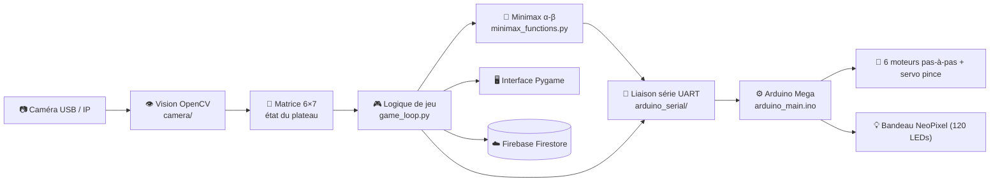
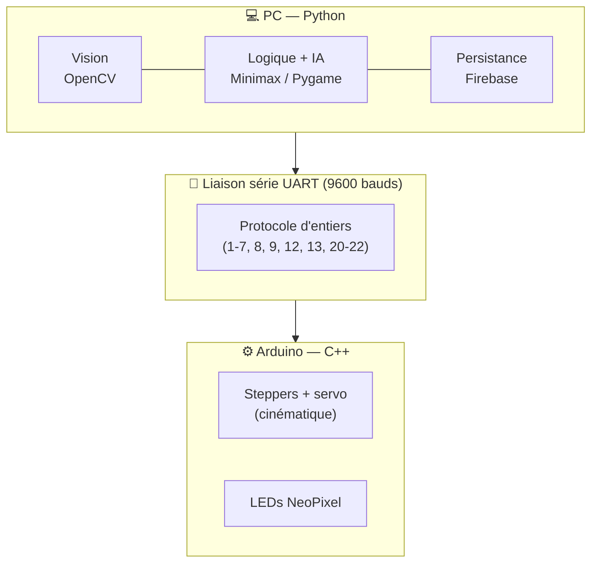
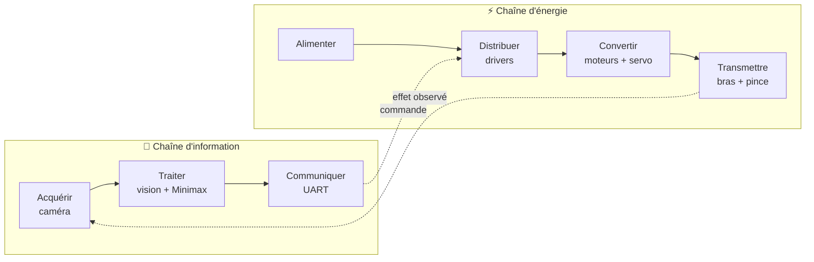

# 🗺️ Architecture du projet Robot J4

> Cartographie technique et pédagogique du dépôt **Robot J4** : à quoi sert chaque
> dossier, dans quel fichier se trouve chaque module (vision, algorithme, communication
> série, LEDs, moteurs, logique de jeu…), comment les couches communiquent, et comment
> lire l'ensemble avec les outils conceptuels des Sciences de l'Ingénieur (SII).

---

## 1. Vue d'ensemble

**Robot J4** est un bras robotisé (base mécanique *BCN3D Moveo*) qui joue au **Puissance 4**
contre un humain, de façon autonome. Le système combine une **vision par ordinateur** qui
lit le plateau réel, un **algorithme de décision Minimax** qui choisit le coup, et une
**commande embarquée Arduino** qui pilote les moteurs, la pince et l'éclairage LED.

Le pipeline complet, d'une partie au déplacement d'un jeton :

> **Caméra → Vision (OpenCV) → Matrice 6×7 → Logique de jeu → Minimax → Liaison série UART → Arduino → Moteurs / Pince / LEDs**

À chaque tour, la caméra **referme la boucle** : le robot ne « croit » pas avoir joué, il
*vérifie* par l'image que le jeton attendu est bien tombé dans la bonne colonne avant de
poursuivre.



Le projet se découpe en **trois couches** qui dialoguent par la liaison série :



---

## 2. Table de correspondance « module → dossier / fichier »

Réponse directe à la question « où se trouve le module qui fait *X* ? ».

| Fonction / module | Emplacement principal | Rôle en une ligne |
|---|---|---|
| **Vision par ordinateur** | [`python/j4_connect4/connect4_robot_j4/camera/camera.py`](../python/j4_connect4/connect4_robot_j4/camera/camera.py) | Détection des jetons (HSV), stabilisation, conversion en matrice |
| **Capture caméra** | [`camera/camera_handler.py`](../python/j4_connect4/connect4_robot_j4/camera/camera_handler.py) | Ouverture caméra USB/IP, image de secours |
| **Calibration couleurs** | [`camera/auto_calibrated.py`](../python/j4_connect4/connect4_robot_j4/camera/auto_calibrated.py) | Réglage interactif des seuils HSV |
| **Algorithme de décision (IA)** | [`minimax/minimax_functions.py`](../python/j4_connect4/connect4_robot_j4/minimax/minimax_functions.py) | Minimax + élagage alpha-bêta + heuristique |
| **Logique & règles du jeu** | [`minimax/minimax_functions.py`](../python/j4_connect4/connect4_robot_j4/minimax/minimax_functions.py) | Plateau, gravité, détection de victoire |
| **Orchestration de la partie** | [`game_loop.py`](../python/j4_connect4/connect4_robot_j4/game_loop.py) | Boucle principale : vision → décision → action |
| **Initialisation de partie** | [`core.py`](../python/j4_connect4/connect4_robot_j4/core.py) | Création de l'état, pseudo joueur, tirage du 1er joueur |
| **État d'exécution** | [`game_state.py`](../python/j4_connect4/connect4_robot_j4/game_state.py) | Variables vivantes de la partie en cours |
| **Données de partie** | [`game_data.py`](../python/j4_connect4/connect4_robot_j4/game_data.py) | Données archivées (coups, résultat, durée…) |
| **Communication série** | [`arduino_serial/`](../python/j4_connect4/connect4_robot_j4/arduino_serial/) | Détection du port, envoi des commandes |
| **Commande du robot** | [`arduino/arduino_main/arduino_main.ino`](../arduino/arduino_main/arduino_main.ino) | Moteurs, pince, **LEDs**, interprétation des commandes |
| **LEDs (bandeau)** | [`arduino/arduino_main/arduino_main.ino`](../arduino/arduino_main/arduino_main.ino) + [`arduino/led/`](../arduino/led/), [`arduino/testled/`](../arduino/testled/) | Pilotage NeoPixel ; outils de test du bandeau |
| **Réglage des positions moteur** | [`arduino/arduino_position/`](../arduino/arduino_position/) | Déplacement libre + retour de position (calibration) |
| **Interface graphique** | [`minimax/minimax_functions.py`](../python/j4_connect4/connect4_robot_j4/minimax/minimax_functions.py) | Plateau virtuel Pygame, animations, messages |
| **Constantes / configuration** | [`constants.py`](../python/j4_connect4/connect4_robot_j4/constants.py) | Seuils HSV, ROI, profondeur Minimax, caméra |
| **Persistance & classement Elo** | [`firebase_db/firebase.py`](../python/j4_connect4/connect4_robot_j4/firebase_db/firebase.py) | Envoi des parties à Firestore, calcul Elo |
| **Maintenance base de données** | [`python/firebase/`](../python/firebase/) | Scripts d'administration Firestore |
| **IA expérimentale (RL)** | [`python/AI/`](../python/AI/) | Apprentissage par renforcement (PyTorch, DQN) — *expérimental* |
| **Mécanique & CAO** | [`docs/BCN3D-Moveo/`](BCN3D-Moveo/) | Fichiers STL, CAO SolidWorks, nomenclature, manuel |
| **Point d'entrée du programme** | [`main.py`](../python/j4_connect4/connect4_robot_j4/main.py) | Commande `connect4` : lance l'initialisation puis la boucle |

---

## 3. Description par module fonctionnel

### 3.1 Vision par ordinateur 👁️

**Dossier :** [`python/j4_connect4/connect4_robot_j4/camera/`](../python/j4_connect4/connect4_robot_j4/camera/)

C'est l'« œil » du robot. À partir du flux vidéo, ce module reconstruit l'état du plateau
sous forme d'une **matrice 6×7** (0 = vide, 1 = jeton rouge, 2 = jeton jaune).

| Fichier | Rôle |
|---|---|
| `camera.py` | Cœur de la détection : reconnaissance des jetons par couleur, stabilisation, validation, conversion en matrice |
| `camera_handler.py` | Gestion matérielle de la caméra (USB ou IP), image de secours si aucune caméra |
| `auto_calibrated.py` | Outil de calibration interactive des seuils de couleur (trackbars) |

**Comment ça marche.**
1. L'image est convertie en espace **HSV** ; deux familles de couleurs sont recherchées
   (rouge et jaune), avec plusieurs plages de seuils par couleur (`constants.py`).
2. La classe `HSVAutoAdjuster` **adapte automatiquement les seuils** à la luminosité
   ambiante (sombre, lumineux, couleurs délavées…) toutes les 2 secondes — c'est ce qui
   rend la détection robuste sous éclairages variables.
3. `detect_circles` isole les pastilles colalées (filtres morphologiques, contours, test
   de **circularité** et d'aire) ; `detect_tokens` les range dans une grille `(ligne, colonne)`.
4. `stabilize_grid` lisse le bruit par **vote majoritaire** sur un tampon des dernières
   images (`BUFFER_SIZE = 20`) : un jeton n'est validé que s'il est vu de façon stable.
5. `is_valid_grid` vérifie la **règle de gravité** (pas de jeton flottant) ;
   `is_valid_move` / `is_valid_new_move` garantissent qu'**un seul** jeton a été ajouté
   entre deux états — ce qui filtre les erreurs de détection et les mains qui passent.

**Entrées :** images de la caméra. **Sorties :** matrice 6×7 validée + colonne/joueur du dernier coup.
**Dépend de :** `constants.py` (seuils, ROI), `minimax` (pour vérifier que le coup détecté
correspond bien au coup attendu de l'IA).

---

### 3.2 Logique & règles du jeu 🎮

**Fichiers :** [`minimax/minimax_functions.py`](../python/j4_connect4/connect4_robot_j4/minimax/minimax_functions.py), [`game_loop.py`](../python/j4_connect4/connect4_robot_j4/game_loop.py), [`core.py`](../python/j4_connect4/connect4_robot_j4/core.py), [`game_state.py`](../python/j4_connect4/connect4_robot_j4/game_state.py), [`game_data.py`](../python/j4_connect4/connect4_robot_j4/game_data.py)

Le **plateau de référence** est un tableau NumPy 6×7 maintenu dans `minimax_functions.py`.
Les fonctions de règles y vivent : `placer_jeton` (avec animation), `coup_valide`,
`verifier_victoire` (4 alignements : horizontal, vertical, deux diagonales), `plateau_plein`.

**`game_loop.py`** est le **chef d'orchestre**. Sa fonction `run_game_loop` exécute en
boucle : lecture d'une image → détection → stabilisation → comparaison à l'état précédent
→ si un coup valide est détecté, mise à jour du jeu et bascule de joueur. Elle gère aussi :
- `detect_game_start` : attend une **grille vide stable** pour démarrer, tire le premier
  joueur et déclenche la première séquence robot ;
- `update_from_camera` : valide le coup détecté, met à jour l'affichage, archive le coup,
  teste la victoire, puis donne la main à l'IA si c'est son tour ;
- `check_victory` : fin de partie, message, signal LED, envoi des données à Firebase.

**`core.py`** prépare une partie : création de l'état, **saisie du pseudo** du joueur
(boîte de dialogue Tkinter), tirage aléatoire du premier joueur, profondeur de l'IA.

**`game_state.py` / `game_data.py`** séparent proprement deux notions :
- `GameState` = **état vivant** (matrices courantes, joueur courant, attente de détection…) ;
- `GameData` = **données à archiver** (identifiant de partie, coups joués, résultat, durées).

**Convention de couleurs :** joueur **1 = rouge = IA**, joueur **2 = jaune = humain**.

---

### 3.3 Algorithme de décision — Minimax 🧠

**Fichier :** [`minimax/minimax_functions.py`](../python/j4_connect4/connect4_robot_j4/minimax/minimax_functions.py) (fonction `minimax` et heuristique)

Le cœur « intelligent » du robot. À son tour, l'IA explore l'arbre des coups possibles
jusqu'à une certaine profondeur et choisit le coup optimal.

- **`minimax(profondeur, alpha, beta, maximizing)`** : algorithme **Minimax classique**
  avec **élagage alpha-bêta** (on coupe les branches qui ne peuvent plus changer la
  décision → exploration beaucoup plus rapide).
- **Heuristique** : `evaluer_position` note le plateau en additionnant le score de toutes
  les fenêtres de 4 cases (`evaluer_fenetre`) — un alignement de 3 avec une case libre vaut
  beaucoup, une menace adverse est pénalisée — avec un **bonus pour le centre**.
- **États terminaux** : victoire = ±1 000 000, nul = 0.
- **Optimisation** : les colonnes sont explorées **du centre vers les bords**, ce qui
  améliore l'efficacité de l'élagage.
- **Profondeur** : `MINIMAX_DEPTH = 7` (dans `constants.py`), réduite en fin de partie.

`tour_ordinateur` calcule le coup, l'affiche, puis l'**envoie à l'Arduino** ; le robot
joue physiquement, et la caméra confirme ensuite que le coup attendu a bien été réalisé
(`verifier_coup_ia` / `confirmer_coup_ia`).

---

### 3.4 Communication série 🔌

**Dossier :** [`arduino_serial/`](../python/j4_connect4/connect4_robot_j4/arduino_serial/)

Le « pont » entre le PC et le robot, via **UART** (port série, 9600 bauds, 8N1).

| Fichier | Rôle |
|---|---|
| `arduino_connection.py` | `detect_arduino` (repère le port par mots-clés : Arduino, CH340, FTDI, CP210x…), `setup_arduino_connection` (ouvre le port), `send_to_arduino` (envoie un message) |
| `serial_connection.py` | Crée l'objet série partagé `serial_obj` une seule fois au démarrage |

La communication repose sur un **protocole d'entiers** simple : le PC envoie un nombre,
l'Arduino l'interprète comme une action (voir [Annexe A](#annexe-a--protocole-de-communication-série)).
Si aucun Arduino n'est détecté, le jeu **continue sans la partie physique** (mode
dégradé) — utile pour développer la vision et l'IA sans le robot.

---

### 3.5 Commande du robot — Arduino ⚙️

**Dossier :** [`arduino/`](../arduino/)

C'est la partie **embarquée** (C++ / Arduino), qui transforme une commande reçue en
mouvements réels et en signaux lumineux.

| Programme | Rôle |
|---|---|
| `arduino_main/arduino_main.ino` | **Programme de jeu.** Pilote 6 moteurs pas-à-pas, le servo de la pince, et le bandeau LED. Seul programme nécessaire pour jouer. |
| `arduino_position/arduino_position.ino` | Déplace librement le bras et **renvoie sa position** → sert à relever les positions en « pas » de chaque colonne (mise au point). |
| `led/led.ino` | Vérifie la **communication couleur** avec le bandeau LED. |
| `testled/testled.ino` | A servi à **détecter le nombre de LEDs** du bandeau. |

**Dans `arduino_main.ino` :**
- **Moteurs** : 6 axes (`stepper_1` à `stepper_5` + `stepper_2b` jumelé) pilotés via la
  bibliothèque **AccelStepper** (vitesse et accélération réglées par axe). Les mouvements
  sont **séquencés en phases** (certains axes démarrent à 20 % de la course des autres)
  pour une trajectoire fluide et sûre.
- **Cinématique de jeu** : `prendreJeton` (prise au distributeur), `posmvt` (position de
  transit), `placerDessusColonne` + `poserDansColonne` (dépose, avec un jeu de positions
  calibrées **par colonne**), `posdistributeur`, `findepartie`.
- **Pince** : servomoteur (`servo_Pince`) ouvert/fermé pour saisir et lâcher le jeton.
- **LEDs** 💡 : bandeau **Adafruit NeoPixel** (120 LEDs). Fonctions `ledsRouges`,
  `ledsJaunes`, `ledsOrange` et leurs versions clignotantes (`flashRouge`…) servent à
  signaler le **tour courant** (rouge = IA, jaune = humain) et l'**issue de la partie**
  (clignotement à la victoire / au nul).

---

### 3.6 Interface graphique 🖥️

**Fichier :** [`minimax/minimax_functions.py`](../python/j4_connect4/connect4_robot_j4/minimax/minimax_functions.py) (partie **Pygame**)

Une fenêtre **Pygame** affiche un Puissance 4 virtuel qui reflète l'état réel : grille
bleue, jetons rouges/jaunes, **animation de chute** (`placer_jeton`), numéros de colonnes,
et une zone de **messages** (`afficher_message` : « L'ordinateur réfléchit… », annonce du
coup choisi, résultat). C'est le miroir numérique du plateau physique, utile en
démonstration et pour suivre la partie.

> Une fenêtre OpenCV affiche en parallèle le **flux caméra annoté** (ROI, grille détectée,
> joueur courant, compte à rebours avant la prochaine analyse). Touches : `q` quitter,
> `r` réinitialiser la partie.

---

### 3.7 Persistance & classement Elo ☁️

**Fichier :** [`firebase_db/firebase.py`](../python/j4_connect4/connect4_robot_j4/firebase_db/firebase.py) — **Scripts d'admin :** [`python/firebase/`](../python/firebase/)

À la fin de chaque partie, les données (`GameData`) sont envoyées à **Firebase Firestore** :
- `send_game_data` enregistre la partie (coups, résultat, durée, couleurs, joueurs) ;
- un système de **classement Elo** met à jour le score du joueur **et** de l'IA
  (`expected_score`, `k_factor`, `update_elo`), avec un facteur K dépendant du niveau de
  l'IA (sa profondeur Minimax) ;
- les nouveaux joueurs reçoivent un **jeton de revendication** (`generate_claim_token`)
  pour rattacher leur pseudo à un compte.

La connexion nécessite la variable d'environnement `FIREBASE_CRED` (chemin vers la clé de
service). Sans elle, l'enregistrement est simplement ignoré (le jeu fonctionne quand même).
Les scripts `python/firebase/` (`rename_doc.py`, `update_users_metadata.py`) sont des
utilitaires de **maintenance** de la base.

---

### 3.8 IA expérimentale — Apprentissage par renforcement 🧪

**Dossier :** [`python/AI/`](../python/AI/) — *⚠️ branche expérimentale, non utilisée en partie réelle*

Une exploration parallèle : entraîner une IA **par apprentissage par renforcement**
(réseau de neurones **DQN**, PyTorch) plutôt que par Minimax. À ne pas confondre avec
l'IA Minimax du jeu (section 3.3), qui est celle réellement embarquée.

| Sous-dossier | Contenu |
|---|---|
| `play_connect4/` | Jouer / tester différents adversaires : `algo_minimax.py`, `random_column.py`, `trained_AI.py`, point d'entrée `puissance4_main.py` |
| `train_AI/Minimax/` | Entraînement DQN contre un adversaire Minimax |
| `train_AI/Selfplayer/` | Entraînement par **self-play** (l'IA joue contre elle-même) |
| `train_AI/randomplayer/` | Entraînement contre adversaire aléatoire / negamax |

Les modèles entraînés sont stockés en `.pth` (PyTorch) et `.onnx` ; les `.bat`
`tensorboard-visualisation` lancent **TensorBoard** pour visualiser l'apprentissage.
Le `README` de ce dossier précise que cette piste **n'a pas encore donné de résultats
fiables** contre un humain.

---

### 3.9 Mécanique & CAO 🦾

**Dossier :** [`docs/BCN3D-Moveo/`](BCN3D-Moveo/)

Toute la base **matérielle** du bras, dérivée du projet open-source **BCN3D Moveo** :

| Sous-dossier | Contenu |
|---|---|
| `CAD files/` | Modèles **SolidWorks** (`.SLDPRT`, `.SLDASM`) : pièces et assemblages |
| `STL files/` | Fichiers **STL** prêts à imprimer (articulations, base, pince, boîtier électronique…) |
| `BOM/` | **Nomenclature** (Bill of Materials) — liste des composants |
| `USER MANUAL/` | Manuel de montage du bras |

À noter aussi [`docs/Cgenial_J4_2025_fr.pdf`](Cgenial_J4_2025_fr.pdf) : le dossier de
présentation du projet (Concours C.Génial).

---

## Annexe A — Protocole de communication série

Le PC envoie un **entier** sur le port série ; l'Arduino (`arduino_main.ino`, fonction
`loop`) l'interprète. C'est l'interface contractuelle entre le logiciel et le matériel.

| Code envoyé | Action côté Arduino | Sens |
|:---:|---|---|
| **1 – 7** | `poserDansColonne(n)` | Déposer un jeton dans la colonne *n* |
| **8** | `ledsRouges()` | LEDs rouges → **tour de l'IA** |
| **9** | `ledsJaunes()` | LEDs jaunes → **tour du joueur** |
| **12** | `posmvt()` | Aller en position de transit |
| **13** | `prendreJeton(...)` | Saisir un jeton au distributeur |
| **20** | `matchNul()` | Match nul (clignotement orange) |
| **21** | `victoireRouge()` | Victoire de l'IA (clignotement rouge) |
| **22** | `victoireJaune()` | Victoire du joueur (clignotement jaune) |

> 💡 Astuce de conception : les codes **8** et **9** correspondent à `joueur_courant + 7`.
> Le même message signale donc à la fois **à qui de jouer** et **quelle couleur** afficher.

---

## Annexe B — Arborescence annotée

```text
Robot_J4/
├── arduino/                         ⚙️ Code embarqué (C++ / Arduino)
│   ├── arduino_main/                   → Programme de jeu (moteurs, pince, LEDs)
│   ├── arduino_position/               → Relevé des positions moteur (calibration)
│   ├── led/                            → Test de la communication couleur LED
│   └── testled/                        → Détection du nombre de LEDs
│
├── python/
│   ├── j4_connect4/                 📦 Paquet installable (commande « connect4 »)
│   │   └── connect4_robot_j4/
│   │       ├── main.py                 → Point d'entrée
│   │       ├── core.py                 → Initialisation de la partie
│   │       ├── game_loop.py            → Boucle principale (orchestration)
│   │       ├── game_state.py           → État vivant de la partie
│   │       ├── game_data.py            → Données archivées
│   │       ├── constants.py            → Seuils HSV, ROI, profondeur Minimax…
│   │       ├── camera/                 👁️ Vision par ordinateur (OpenCV)
│   │       │   ├── camera.py               → Détection, stabilisation, matrice
│   │       │   ├── camera_handler.py       → Capture USB / IP, image de secours
│   │       │   └── auto_calibrated.py      → Calibration interactive des couleurs
│   │       ├── minimax/                🧠 Logique de jeu + IA + interface Pygame
│   │       │   └── minimax_functions.py    → Plateau, règles, Minimax α-β, affichage
│   │       ├── arduino_serial/         🔌 Communication série (UART)
│   │       │   ├── arduino_connection.py   → Détection du port, envoi
│   │       │   └── serial_connection.py    → Objet série partagé
│   │       └── firebase_db/            ☁️ Persistance Firestore + Elo
│   │           └── firebase.py
│   │
│   ├── AI/                          🧪 IA expérimentale (RL, PyTorch) — non embarquée
│   │   ├── play_connect4/              → Jouer / tester des adversaires
│   │   └── train_AI/                   → Entraînement (Minimax, self-play, aléatoire)
│   │
│   └── firebase/                    🛠️ Scripts de maintenance Firestore
│
├── docs/
│   ├── BCN3D-Moveo/                 🦾 Mécanique : CAO, STL, nomenclature, manuel
│   └── Cgenial_J4_2025_fr.pdf          → Dossier de présentation du projet
│
└── README.md                           → Présentation générale
```

---

## 4. Lecture pédagogique — angle Sciences de l'Ingénieur

Robot J4 est un **système pluritechnologique** complet : il associe mécanique, électronique,
informatique, traitement d'image et intelligence artificielle autour d'une fonction de
service simple à énoncer — *jouer au Puissance 4 contre un humain*. C'est cette lisibilité
qui en fait un support d'étude riche pour la SII.

### 4.1 Lecture par chaînes fonctionnelles

On peut relire l'architecture précédente avec les deux chaînes de la SII.

**Chaîne d'information** (acquérir → traiter → communiquer) :

| Fonction | Réalisation dans Robot J4 |
|---|---|
| **Acquérir** | Caméra + détection des jetons (`camera/`) |
| **Traiter** | Reconstruction de l'état (matrice 6×7) + décision Minimax (`minimax/`) |
| **Communiquer** | Liaison série UART, protocole d'entiers (`arduino_serial/`) |

**Chaîne d'énergie** (alimenter → distribuer → convertir → transmettre) :

| Fonction | Réalisation dans Robot J4 |
|---|---|
| **Alimenter** | Alimentation **24 V** pour les moteurs pas-à-pas, **5 V** pour le servomoteur de la pince |
| **Distribuer** | Drivers de moteurs pas-à-pas pilotés par l'Arduino |
| **Convertir** | Moteurs pas-à-pas (24 V) + servomoteur de pince (5 V) : énergie électrique → mouvement |
| **Transmettre** | Articulations du bras BCN3D Moveo → dépose du jeton |



### 4.2 Notions de SII illustrées par le projet

- **Système bouclé / asservissement par la perception.** Le robot ne suppose pas que son
  coup a réussi : la caméra **vérifie** le résultat avant de continuer. La boucle
  *consigne (coup choisi) → action (dépose) → mesure (vision) → comparaison* est un excellent
  support pour parler de retour d'information et de robustesse.
- **Architecture en couches & interfaces.** La frontière PC ↔ Arduino est un **contrat**
  minimal (un entier = une action). On peut faire évoluer la vision ou l'IA sans toucher
  au firmware, et inversement — illustration concrète du couplage faible.
- **Conception modulaire logicielle.** Chaque dossier a une responsabilité unique (voir
  §2-3), avec des dépendances explicites : un cas d'étude pour l'**ingénierie logicielle**.
- **Théorie des jeux & algorithmique.** Minimax, élagage alpha-bêta et heuristique
  d'évaluation : un support tangible pour aborder la complexité et l'optimisation.
- **Traitement d'image.** Espace colorimétrique HSV, seuillage adaptatif, filtrage
  morphologique, vote majoritaire temporel : la chaîne complète d'une mesure par vision.
- **Mode dégradé & robustesse.** Absence d'Arduino, de caméra ou de base de données : le
  système continue de fonctionner partiellement. Bonne entrée pour parler de tolérance aux
  pannes et de sûreté de fonctionnement.

### 4.3 Pistes d'exploitation en classe

- Faire **identifier les chaînes fonctionnelles** à partir du système réel ou de ce document.
- Étudier le **protocole série** (Annexe A) comme exemple d'interface matériel/logiciel.
- Analyser l'**influence de la profondeur Minimax** sur la qualité de jeu et le temps de calcul.
- Étudier la **robustesse de la vision** face aux variations d'éclairage (seuils HSV adaptatifs).
- Comparer deux approches d'IA : **Minimax** (déterministe, embarqué) vs **apprentissage
  par renforcement** (statistique, expérimental, §3.8).

---

*Document de référence pour les contributeurs et base de travail pour la valorisation
académique (revue SII). Toute évolution du code devrait s'accompagner d'une mise à jour de
la table de correspondance (§2).*
